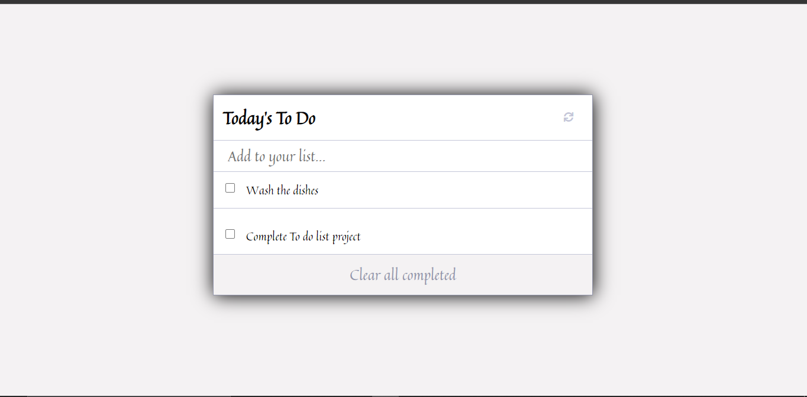

# To_DO_List
This the minimal to do list done using JavaScript, html and CSS

> In this project, we built a basic to do list website: plain JavaScript with objects, that allows users to add/remove tasks from a list.

This to do list task 1 was done using Javascript, Html and Css by implementing webpack functionalities.

## Built With

- JavaScript (ES6)
- HTML and CSS
- Webpack

## Instructions on setting up your project locally

To get a local copy follow these simple example steps.

1.- Clone the repository using this command:
    git clone [this link](https://github.com/Micky373/To_DO_List.git) 

2.- Then you can open the index.html file in the dist folder to see the demo

3.- To see the code open the project in your code editor of your preference.

## Live Demo 

[Click here to see the To do list App](https://micky373.github.io/To_DO_List/dist/) 

## Author

👤 **Michael Tamirie**

- GitHub: [@MichaelTamirie](https://github.com/Micky373)
- LinkedIn: [Michael_Tamirie](https://www.linkedin.com/in/michael-tamirie-288a331ab)

## 🤝 Contributing

Contributions, issues, and feature requests are welcome!

Feel free to check the [issues page](https://github.com/Micky373/To_DO_List/issues).

## Show your support

Give a ⭐️ if you like this project!

## Acknowledgments

- Hat tip to anyone whose code was used
- Inspiration
- etc

## 📝 License

This project is [MIT](./MIT.md) licensed.

